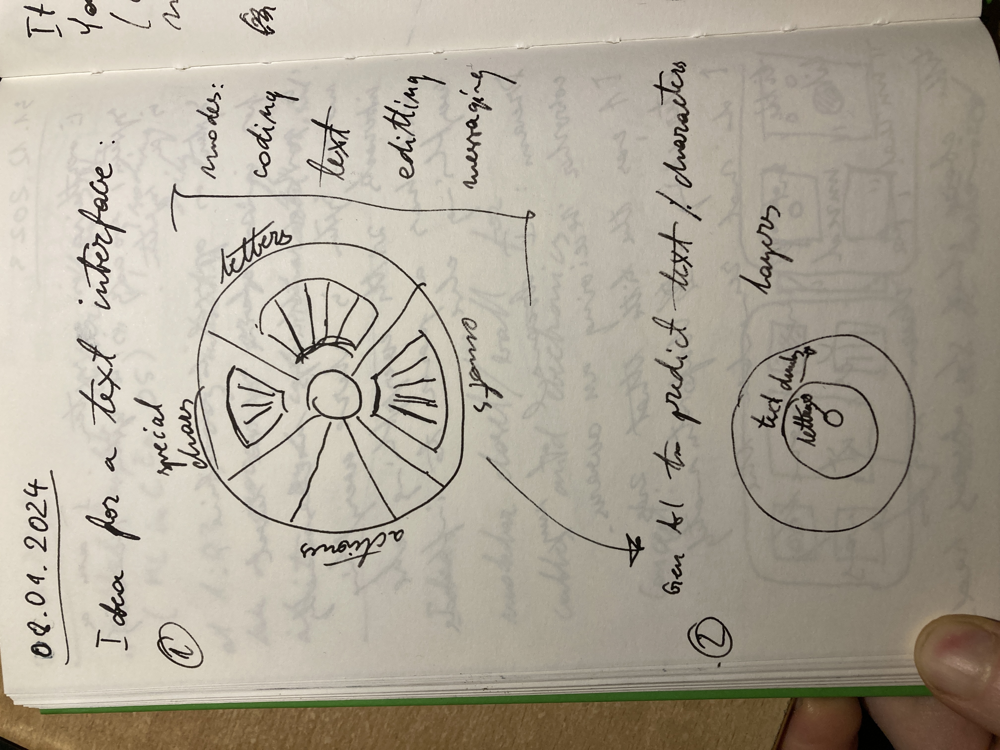
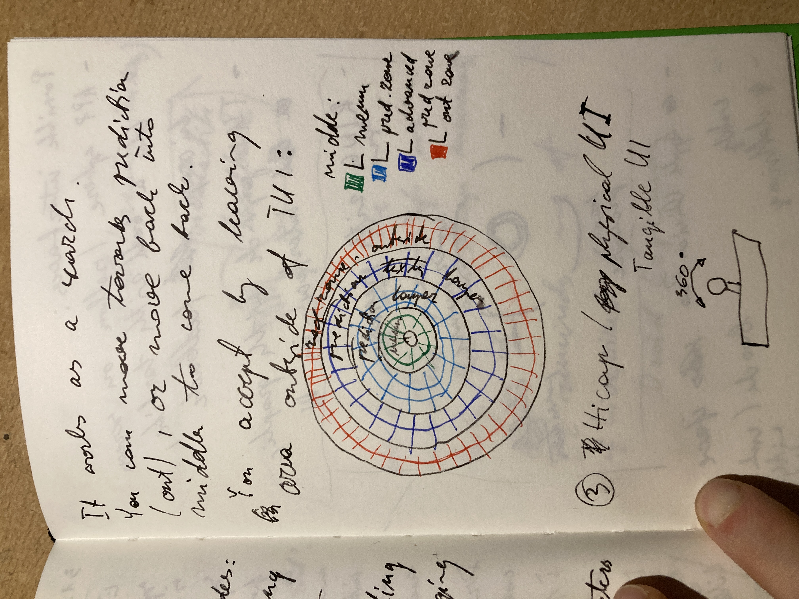
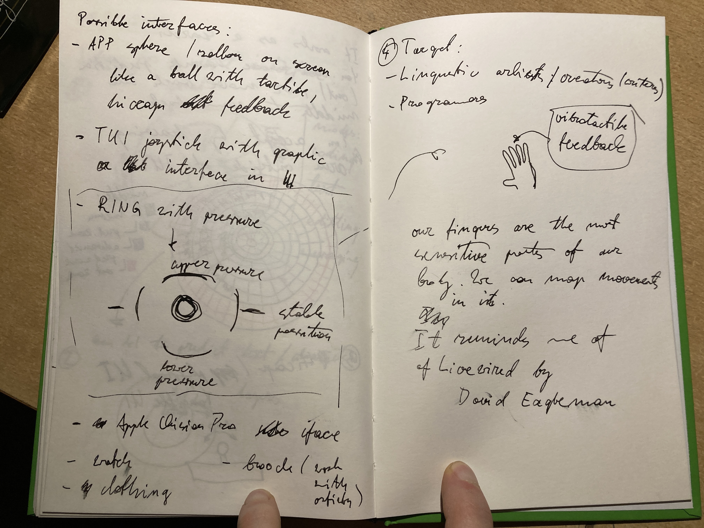
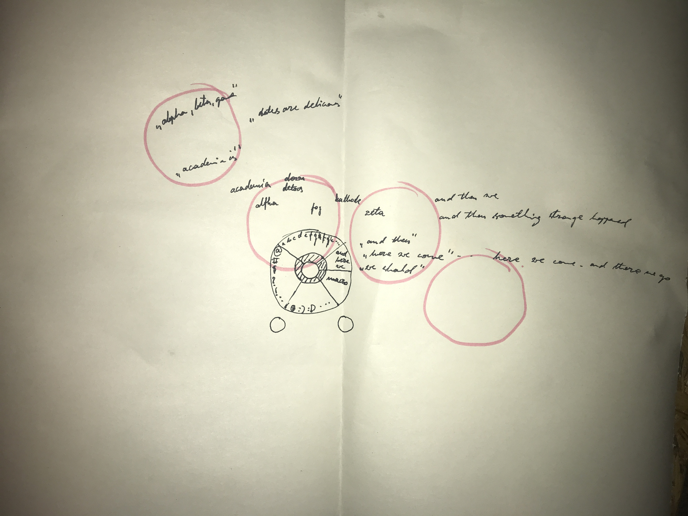

# TUI Typist

It's an idea for new way of writing text. The concept is basically following:

 

### 18.01.2024 update

After consideration it makes most sense to explore two possibilities - I think they don't exclude each other:
- one of the proposed above - I think something that can be very small, that can be manipulated without "attention" would be most practical and most ergonomic, so a joisticky thing, or like a surface to move around using thumb with single hand - but all in all I think that wouldn't be that enticing for most people. Most ergonomic things are not most loved ones.
- smartphone screen - in the end the kind of thing I'm prototyping is supposed to replace standard forms of expression. Smartphones proved their excellent availability. One ring to rule them all. If it is handy enough and more efficient in using than keyboard both for casual messages, note sharing and for work (including development), it would be huge, because spoken language seems to be the most efficient for us to share, but it's not a good interface for work, it's very dependent on the place you are in, while having a silent form of communication allows to "work" everywhere. Keyboard on the other hand is also very dependent on where we are, we take our phones everywhere.

So, the idea is based on a circular interface that starts in the middle.
The interface is basically interface between thumb and neural network.
We literally search neural network based on position of the thumb.
As we move around the field of possibilities "closes" on the kind of sentence/idea we want to express.
We start with single symbol/token and as we move the screen around the most probable words/concepts appear.
We have special areas of the phone to allow unLLMed concepts -> interaction with the phone, automatization, shortcuts, emoji's too maybe.
The interface might also be used as a cursor in some circumstances - I'm not sure how good that would be - I love touchpad, but phone screen might not be accurate and fast enough.
This app would be integrated with Bluetooth, so one could use it as a communication device with a computer, completely replacing mouse/keyboard.

#### Next steps

- build a POC to see how efficient it is, how good are the predictions - is screen big enough? how to arange the words, how to handle feedback? how to make it intuitive to use?

